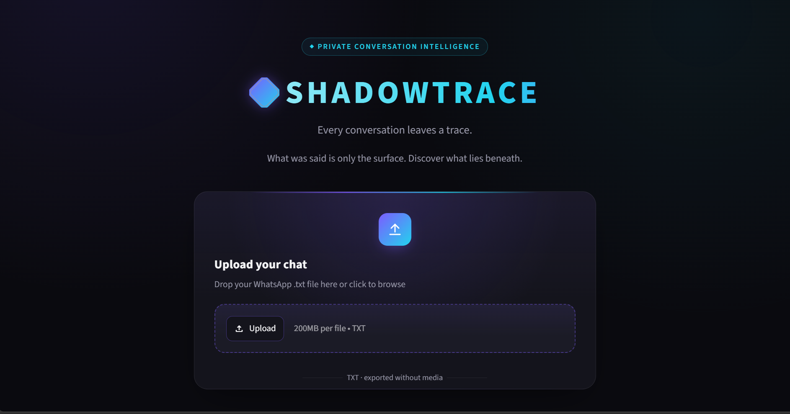
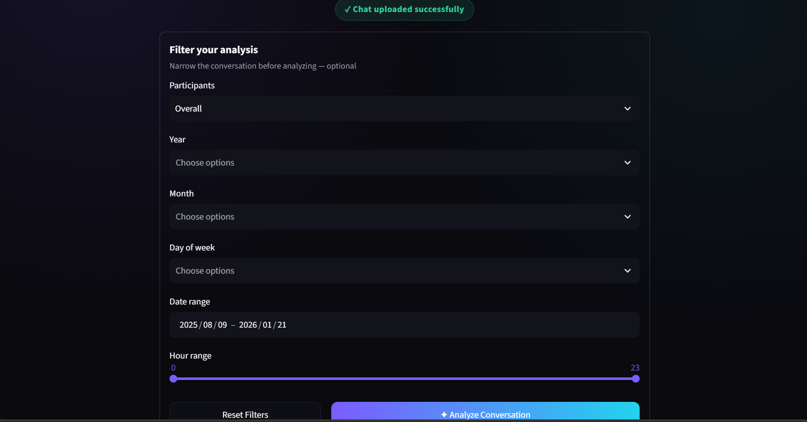
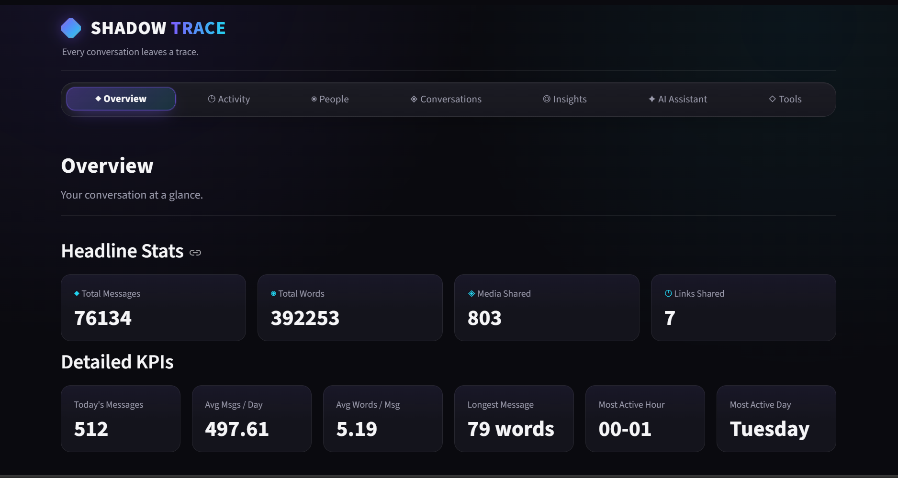
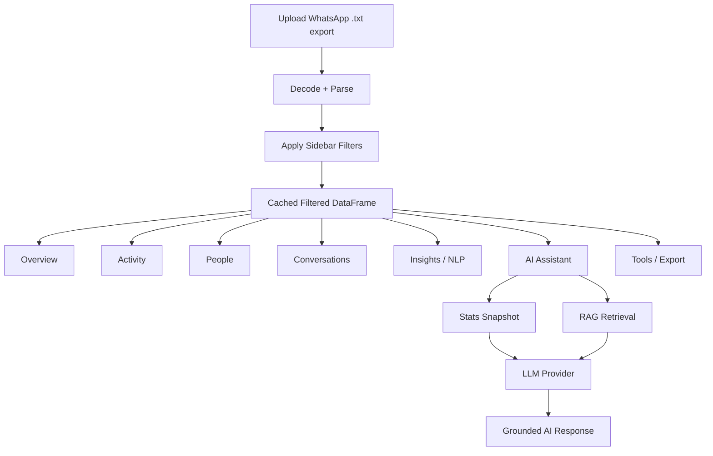
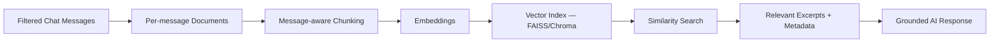
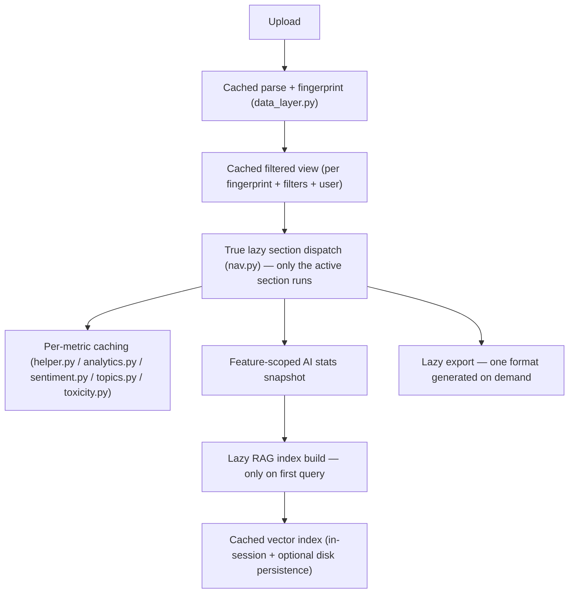
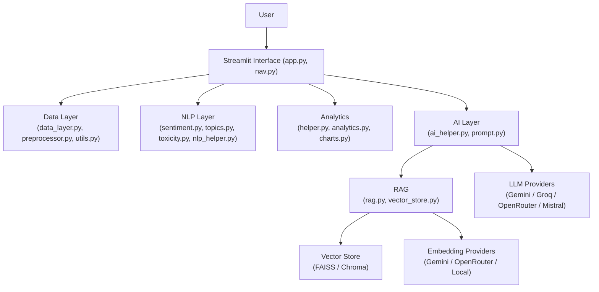

# 🔷SHADOWTRACE

### Every conversation leaves a trace.

> What was said is only the surface. Discover what lies beneath.

SHADOWTRACE is an AI-powered conversation intelligence application built on Streamlit that turns an exported WhatsApp chat into structured, explorable insight: activity patterns, participant behavior, sentiment and emotion, discussion topics, and AI-generated summaries you can question directly. It goes beyond a basic "chat analyzer" by combining classical NLP (sentiment, topic modeling, keyword extraction, language detection) with a multi-provider LLM layer and a Retrieval-Augmented Generation (RAG) pipeline, so you can both *see* patterns in charts and *ask* the conversation questions in plain language.

---

## 🌐 Try SHADOWTRACE Online

Experience SHADOWTRACE directly in your browser — no installation required.

🚀 **Live Application:**  
👉 [Launch SHADOWTRACE](https://shadowtrace.streamlit.app/)

Upload your exported WhatsApp chat, apply filters, and uncover hidden patterns, people, moments, and AI-powered insights.

---

## 📤 How to Export Your WhatsApp Chat

SHADOWTRACE analyzes exported WhatsApp chat files. Before uploading your conversation, export the chat **without media**.

### 📱 Android

1. Open **WhatsApp**.
2. Open the chat you want to analyze.
3. Tap the **three dots (⋮)** in the top-right corner.
4. Select **More → Export chat**.
5. Choose **Without media**.
6. Save or share the exported `.txt` file.
7. Upload the file to SHADOWTRACE.

### 🍎 iPhone (iOS)

1. Open **WhatsApp**.
2. Open the chat you want to analyze.
3. Tap the **contact or group name** at the top.
4. Scroll down and select **Export Chat**.
5. Choose **Without Media**.
6. Save the exported `.txt` file.
7. Upload the file to SHADOWTRACE.

> 🔒 **Privacy Tip:** Always select **Without Media**. SHADOWTRACE only needs the exported text conversation for analysis.

---

## 🎥 SHADOWTRACE in Action

<!-- [▶ Watch the SHADOWTRACE Demo](YOUR_VIDEO_LINK_HERE) -->


The best walkthrough follows the app's own flow:

```
Landing Page
    ↓
Upload WhatsApp Chat
    ↓
Apply Filters
    ↓
Analyze Conversation
    ↓
Overview Dashboard
    ↓
Activity Insights
    ↓
People Analysis
    ↓
Conversation Exploration
    ↓
AI Insights
    ↓
AI Assistant
    ↓
Semantic Search
```

---

## 📸 Interface Preview


### Landing Experience


### Filter option


### Dashboard Overview


<!-- ### Conversation Insights -->
<!-- Add screenshot: assets/screenshots/insights.png -->

<!-- ### AI Assistant -->
<!-- Add screenshot: assets/screenshots/ai-assistant.png -->

<!-- ### Semantic Search -->
<!-- Add screenshot: assets/screenshots/semantic-search.png -->

<!-- --- -->

## Why SHADOWTRACE?

| Challenge | SHADOWTRACE Helps You |
|---|---|
| Thousands of messages, no way to see the shape of a conversation | Turns raw exports into timelines, KPIs, and activity heatmaps |
| "What did we actually talk about in March?" | Ask directly — AI Assistant answers grounded in your own computed stats and retrieved excerpts |
| Finding one specific exchange in tens of thousands of messages | Semantic Search retrieves relevant chunks by meaning, not just keyword match |
| Sentiment/mood buried in volume | Per-message sentiment (VADER) and emotion classification, visualized over time |
| Long conversations are hard to summarize | AI-generated daily/weekly/monthly/full-selection summaries |
| Wanting the numbers, not just a narrative | Every AI feature is grounded in numbers computed first in Python — the LLM narrates real stats, it doesn't invent them |

---

## Key Features

### 📊 Conversation Intelligence
- Headline stats (messages, words, media, links) and detailed KPIs (avg messages/day, most active hour/day, longest message)
- Monthly and daily message-volume timelines
- Day-of-week × hour-of-day activity heatmap, hourly activity chart, weekend-vs-weekday comparison
- Calendar heatmap and message-frequency views

### 👥 People & Participation
- Most active participants, ranked by message share
- Head-to-head user comparison
- Engagement scoring across participants
- Sleep-schedule estimation from message timing

### 💬 Conversation Exploration
- Word cloud and most-common-words (Hinglish + English stopword-aware)
- Emoji frequency and emoji-usage timeline (overall and per user)
- Conversation starters, message-length stats, longest-message lookup
- Shared links/domains, top n-grams
- Response-time distribution and trend
- In-app message search
- Auto-generated weekly report (non-AI, statistics-based)

### 🧠 NLP Insights
- Sentiment distribution and sentiment-over-time (VADER, tuned for short informal text)
- Emotion detection (lexicon + emoji cues, with a sentiment-based fallback) and intent classification (Study/Work/Travel/Shopping/Movies/Sports)
- Topic modeling (LDA by default; upgrades automatically to BERTopic if installed)
- Keyword extraction (TF-IDF baseline; upgrades to YAKE or KeyBERT if installed)
- Extractive text summarization (TF-IDF sentence scoring, fully offline)
- Toxicity/spam heuristics (lightweight keyword-based scoring — no heavy ML model)
- Language detection tuned for Hinglish (Devanagari + romanized Hindi stop-word heuristics, English, and Mixed)
- Word-similarity explorer (TF-IDF distributional similarity, computed from your own chat's vocabulary)

### 🤖 AI Assistant
- Chat summaries: daily, weekly, monthly, or the whole current selection
- Ask & Chat — free-text Q&A grounded in computed stats plus RAG-retrieved excerpts, with short-term conversational memory
- Obviously-factual questions ("Who talks the most?") are answered directly from Python analytics, skipping the LLM entirely
- AI Insights — non-obvious cross-metric observations
- AI Recommendations — exactly five concrete, data-backed suggestions
- Conversation Quality Score — a computed score with an LLM-written justification
- Smart Conversation Highlights — funny exchanges, decisions, and turning points pulled from a real message sample
- People Analysis — informal communication-style read per participant, plus a two-person "dynamic" read between any pair

### 🔎 Semantic Search
- Meaning-based retrieval over the chat via a vector index, independent of the AI chat features

### 📤 Export Tools
- CSV, Excel, and PDF export of the current filtered selection (Unicode/Hindi and emoji safe), generated on demand — not pre-built for every format on tab open

### ⚡ Performance
- True lazy section loading — switching tabs never re-runs unrelated sections
- Multi-layer caching (parsing, filtering, every NLP computation, AI stats snapshots, RAG indexes, export bytes)
- Feature-scoped AI context — each AI feature only computes the statistics it actually needs
- Opt-in performance-debug panel showing per-stage timing and cache behavior

---

## Application Workflow



---

## Application Sections

SHADOWTRACE uses a true lazy-loading navigation model: exactly one top-level section (and, inside it, one sub-section) executes per interaction — switching sections never silently re-runs the others.

### Overview
Headline stats, detailed KPIs, a monthly "Conversation Pulse" timeline, an auto-generated highlights list, and a daily message-volume timeline.

### Activity
- **Daily & Hourly** — busiest day/month, hourly activity
- **Weekend & Peak** — weekend vs. weekday comparison, peak/quiet hours
- **Sleep Schedule** — estimated sleep window from message timing

### People
- **Most Busy Users** — ranked by message share
- **Compare Users** — side-by-side statistics for two participants
- **Engagement Score** — computed engagement ranking

### Conversations
Word Cloud & Common Words, Emoji, Emoji Timeline, Starters & Frequency, Message Stats, Phrases & Domains, Response Time, an auto-generated Weekly Report, and in-app Search.

### Insights
Sentiment, Emotion & Intent, Topics, Keywords, Summarizer, Toxicity, Language & Quality, and Word Similarity.

### AI Assistant
Summaries, Ask & Chat, Insights & Recommendations (bundles AI Insights, AI Recommendations, and the Conversation Quality Score), Semantic Search, Highlights, and People Analysis (bundles the Personality read and the two-person Friendship dynamic read).

### Tools
Export the current filtered selection as CSV, Excel, or PDF — one format generated per click, not all three pre-built on tab open.

---

## 🤖 AI Architecture

AI generation is routed through **LangChain**, with a fixed fallback chain across four providers:

```
Gemini → Groq → OpenRouter → Mistral
```

- `AI_PROVIDER=auto` (default): tries each provider in that order, using only the ones with a configured API key, and stops at the first success — normally exactly one provider is contacted per request.
- `AI_PROVIDER=gemini|groq|openrouter|mistral`: pins generation to that one provider only; if its key is missing, the AI tab shows a configuration message instead of silently substituting another provider.
- OpenRouter is reached via LangChain's OpenAI-compatible client (`ChatOpenAI`) pointed at OpenRouter's API — no separate SDK required.

**Reliability behavior, as implemented:**
- Each provider client has a configurable per-request network timeout (`AI_REQUEST_TIMEOUT_SECONDS`), so one slow/unresponsive provider can't stall the whole fallback chain on its SDK's own default timeout.
- If a response looks truncated (checked first against the provider's own `finish_reason` metadata, falling back to a conservative text heuristic only when that metadata is unavailable), the app retries **once**, on the **same** provider, with a larger — but capped — output-token budget (`min(current_budget × 2, LLM_MAX_OUTPUT_TOKENS_RETRY_CAP)`). It never loops and never discards a usable original response if the retry fails.
- AI Recommendations has a separate corrective-retry path (`AI_MAX_RETRY`) if the model doesn't return exactly five numbered items — this is a formatting check, not the truncation check above.
- Gemini's "thinking" configuration is wired defensively: it's only sent to thinking-capable model families (`GEMINI_THINKING_MODEL_PREFIXES`), and only if the installed `langchain-google-genai` version actually exposes a recognized thinking-budget parameter (checked via constructor introspection) — an unsupported SDK version degrades to "not sent," never a crash.
- A provider that returns a quota/rate-limit failure is skipped for a cooldown window (`PROVIDER_QUOTA_COOLDOWN_SECONDS`) on subsequent requests in the same session, rather than being retried immediately every time.

---

## RAG and Semantic Search



- **Indexing is lazy** — building the vector index only happens when Semantic Search or Ask & Chat actually runs a query; opening the AI Assistant tab alone never triggers embedding.
- **Chunking is message-aware**: consecutive messages are grouped up to `RAG_CHUNK_SIZE` characters (never splitting a message mid-text), and each resulting chunk retains real metadata — participants, date range, and message-index range — instead of being an anonymous blob of text.
- **Embeddings** follow their own priority chain, independent of the generation chain above: `Gemini → OpenRouter → a local, key-free hashing fallback`. Groq and Mistral are never used for embeddings.
- **Vector store backend**: FAISS by default (`VECTOR_STORE_BACKEND=faiss`), with Chroma supported as an alternative.
- **Caching**: the index is cached in-session (`st.cache_resource`) keyed by a fingerprint of the chat + active filters + selected user, so changing an unrelated setting never triggers a rebuild — only a genuine change to the underlying selection does.
- **Persistence**: by default (`RAG_PERSIST_INDEX=true`) the index is also saved to disk under `.vector_store/`, keyed by that same fingerprint, so re-opening the same chat selection in a later session loads the saved index instead of re-embedding from scratch.
- **Fallback recovery**: if the embedding provider an index was built with becomes unavailable between build and query time, the stale index is discarded and rebuilt fresh with whatever provider is currently available — never silently mixed vectors from two different embedding providers.

---

## Technology Stack

| Category | Technology | Purpose |
|---|---|---|
| Frontend | Streamlit | Interactive application interface |
| Data Processing | Pandas | Chat parsing, filtering, and statistics |
| Visualization | Plotly | Interactive charts across every section |
| Export | openpyxl, reportlab | Excel and PDF export (Unicode/Hindi-safe) |
| NLP — Sentiment | vaderSentiment | Rule-based sentiment scoring for short/informal text |
| NLP — Language | langdetect | English detection, combined with a Hinglish/Devanagari heuristic |
| NLP — Readability | textstat | Flesch Reading Ease scoring (with a manual fallback if unavailable) |
| NLP — Topics/Keywords | scikit-learn (LDA, TF-IDF), yake | Baseline topic modeling and keyword extraction; upgrades to BERTopic/KeyBERT if separately installed |
| Word Cloud | wordcloud, urlextract, emoji | Word-frequency visualization and link/emoji parsing |
| AI Orchestration | LangChain (`langchain`, `langchain-core`, `langchain-community`, `langchain-text-splitters`) | Prompt templating and provider-agnostic chat interface |
| AI — Generation | langchain-google-genai, langchain-groq, langchain-openai (via OpenRouter), langchain-mistralai | Gemini, Groq, OpenRouter, Mistral chat generation |
| AI — Embeddings | langchain-google-genai, langchain-openai (via OpenRouter) | Gemini and OpenRouter embeddings, with a local hashing fallback |
| Vector Search | faiss-cpu (default), langchain-chroma + chromadb (optional) | Similarity search over embedded conversation chunks |
| Config | python-dotenv | `.env`-based configuration |

---

## ⚡ Performance Architecture



Verified optimizations:
- **Lazy navigation** — `nav.py` implements section switching as plain conditional dispatch, not `st.tabs()`, so only the active section's render function executes per rerun.
- **Cached preprocessing** — the raw chat is parsed exactly once per unique uploaded file (keyed by a content fingerprint), regardless of how many times the UI reruns.
- **Cached filtering** — the sidebar-filtered view is cached per (fingerprint, user, filters) combination, shared across every tab that reads it.
- **Per-metric NLP caching** — every sentiment/emotion/topic/keyword/toxicity computation is cached independently, so switching between features that share an underlying metric doesn't recompute it.
- **Feature-scoped AI context** — each AI feature (Summary, Recommendations, Ask & Chat, People Analysis) only computes the subset of statistics it actually uses, rather than a single all-metrics bundle for every feature.
- **Lazy RAG indexing** — embeddings are only computed when a query is actually run, not on opening the AI tab.
- **Lazy export generation** — CSV/Excel/PDF bytes are generated one format at a time, on request, and cached per the exported data's content.
- **Large-chat behavior** — per-message NLP passes (VADER sentiment, emotion/emoji scanning) are pure-Python and scale with message count; on very large chats (tens of thousands of messages), the first computation of a given metric is the dominant cost, with subsequent reuse served from cache.

---

## Project Architecture



---

## Project Structure

```
SHADOWTRACE/
│
├── app.py                  # Streamlit entrypoint — landing page, sections, sidebar
├── config.py                # All configuration: providers, thresholds, paths
├── nav.py                   # Lazy section/sub-section navigation + performance debug panel
│
├── data_layer.py            # Fingerprinting, cached parsing, cached filtering, safe decoding
├── preprocessor.py          # Raw WhatsApp .txt export → DataFrame
├── helper.py                 # Core chat statistics (headline stats, timelines, word/emoji frequency)
├── analytics.py              # Extended analytics (response time, engagement, sleep schedule, n-grams, ...)
├── charts.py                 # Plotly chart builders
├── utils.py                   # Filtering, KPI computation, CSV/Excel/PDF export
│
├── ai_helper.py               # Multi-provider LLM orchestration, truncation retry, feature-scoped context
├── prompt.py                   # All LangChain prompt templates
├── rag.py                      # RAG retrieval + context-block building
├── vector_store.py             # Embeddings, chunking, FAISS/Chroma index build + persistence
│
├── sentiment.py                # VADER sentiment + emotion detection + TF-IDF important words
├── topics.py                   # Topic modeling, keyword extraction, summarization, intent classification
├── toxicity.py                  # Keyword-heuristic toxicity + spam detection
├── nlp_helper.py                 # Shared text cleaning, language detection, readability, word similarity
│
├── stop_hinglish.txt              # Hinglish + English stopword list (referenced by config.STOPWORDS_PATH)
├── assets/
│   └── logo.png                    # Optional brand mark (referenced by nav.py; app runs fine without it)
│
├── requirements.txt
├── _env.example
└── README.md
```

> **Note:** `stop_hinglish.txt` and `assets/logo.png` are referenced by `config.py`/`nav.py` but their presence couldn't be independently verified in the inspected file set — both are designed to degrade gracefully if missing (the logo falls back to a plain glyph icon; see `_env.example` for stopword-related behavior).

---

## Installation

```bash
git clone https://github.com/himanshugithub360/SHADOWTRACE
cd SHADOWTRACE

python -m venv .venv
```

**Windows:**
```bash
.venv\Scripts\activate
```

**Linux/macOS:**
```bash
source .venv/bin/activate
```

```bash
pip install -r requirements.txt
streamlit run app.py
```

No API key is required to run the app — every non-AI section works fully offline, the AI Assistant tab shows a setup notice instead of erroring, and Semantic Search still works via the local, key-free embedding fallback.

---

## 🔐 Configuration

Copy `_env.example` to `.env` and fill in only the keys you have — every variable is optional.

```dotenv
# AI generation — pick a provider or leave "auto" to fall through the chain
AI_PROVIDER=auto
GOOGLE_API_KEY=
GROQ_API_KEY=
OPENROUTER_API_KEY=
MISTRAL_API_KEY=

# LLM behavior
LLM_TEMPERATURE=0.3
LLM_MAX_OUTPUT_TOKENS=2048
LLM_MAX_OUTPUT_TOKENS_RETRY_CAP=4096
AI_REQUEST_TIMEOUT_SECONDS=20
GEMINI_THINKING_BUDGET=0

# RAG / vector store
VECTOR_STORE_BACKEND=faiss
RAG_CHUNK_SIZE=1000
RAG_CHUNK_OVERLAP=150
RAG_TOP_K=6
RAG_PERSIST_INDEX=true

# Performance
PERFORMANCE_DEBUG=false
```

See `_env.example` in the repository for the complete, fully-commented list — every variable there is read by `config.py` and nothing else is silently assumed.

---

## AI Provider Configuration

**Generation providers** (chat/text output — Summaries, Recommendations, Insights, Ask & Chat, Highlights, Personality/Friendship reads):
```
Gemini → Groq → OpenRouter → Mistral
```

**Embedding providers** (RAG / Semantic Search only — a *separate* priority list):
```
Gemini → OpenRouter → Local (free, key-free hashing fallback)
```

These two chains are intentionally independent — Groq and Mistral are never used for embeddings, and `AI_PROVIDER` (which pins generation to one provider) has no effect on which embedding provider is used.

---

## Usage Guide

**Step 1 — Export WhatsApp Chat.** From WhatsApp, export a chat as a `.txt` file (12-hour clock format, e.g. `12/08/24, 9:41 pm - Name: message`). Both individual and group chat exports are supported.

**Step 2 — Upload.** Drop the `.txt` file on the landing page. Non-UTF-8 exports (BOM, UTF-16, or other legacy encodings) are handled automatically with a safe fallback chain.

**Step 3 — Filter.** Optionally narrow by year, month, date range, or hour-of-day before analyzing.

**Step 4 — Analyze.** Click through to the dashboard — parsing and filtering are cached, so re-analyzing the same file is fast on subsequent runs.

**Step 5 — Explore.** Move through Overview, Activity, People, Conversations, and Insights — each loads independently and lazily.

**Step 6 — Ask AI Questions.** In the AI Assistant tab, use Ask & Chat for free-text questions, or generate a Summary, Recommendations, Insights, or Highlights.

**Step 7 — Search Conversations.** Use Semantic Search to retrieve relevant excerpts by meaning rather than exact keyword match.

**Step 8 — Export Results.** In Tools, pick CSV, Excel, or PDF and generate the file for your current filtered selection.

---

## Performance Notes

- **First-time NLP computation** (sentiment, emotion, topic modeling) on a given chat selection is the dominant cost on very large chats — this is cached afterward for that exact selection.
- **First semantic index creation** costs one embedding pass over the indexed selection; later queries against the same selection reuse the cached (and optionally disk-persisted) index.
- **API response time** for AI features depends entirely on the LLM provider actually being used and is outside the app's control — the multi-provider fallback and per-request timeout exist specifically to bound how long a single slow/unresponsive provider can hold up a response.
- No fixed response-time numbers are promised here, as this depends heavily on chat size, selected filters, and which provider answers.

---

## 🔒 Privacy Considerations

Read this before uploading a conversation that includes other people's messages.

- **Non-AI features are fully local.** Overview, Activity, People, Conversations, Insights (NLP), and Export never send any data anywhere — everything runs in your own Python process.
- **AI features send conversation content to third-party providers.** Summaries, Ask & Chat, Insights, Recommendations, Highlights, and People Analysis send computed statistics and/or real message excerpts (including participant names) to whichever LLM provider is configured (Gemini, Groq, OpenRouter, or Mistral).
- **Semantic Search and Ask & Chat's retrieval step also send message content to an embeddings provider** (Gemini or OpenRouter), unless no API key is configured, in which case a local, key-free hashing fallback is used instead — that path never leaves your machine, at the cost of lower retrieval quality.
- **The vector index is written to disk by default** (`RAG_PERSIST_INDEX=true`), under `.vector_store/`, and contains the actual chunked message text alongside embeddings — not just vectors. This persists across sessions until manually removed; switching to a different uploaded chat does not currently delete the previous chat's on-disk index.
- **No message content is anonymized** before being sent to an AI provider — real names and real text are used as written.
- You are analyzing conversations that may include other people who have not consented to AI analysis of their messages. Only use the AI features on conversations you have the right and the other participants' consent to process this way.

---

<!-- ## Testing

Automated verification lives in `tests/` as standalone Python scripts (not a pytest suite — each is run directly and prints a pass/fail summary):

```bash
python tests/test_decoding.py
python tests/test_rag_metadata.py
python tests/test_ai_truncation.py
```

| Test file | Covers |
|---|---|
| `test_decoding.py` | Safe upload decoding — UTF-8, UTF-8 with BOM, Hindi/Devanagari, emoji, mixed-language, empty file, invalid binary content, encoding fallback |
| `test_rag_metadata.py` | Message-aware chunking — per-chunk metadata (users, date range, message-index range), multi-chunk splitting, empty-input handling |
| `test_ai_truncation.py` | Truncation detection (provider metadata + heuristic fallback) and the bounded single-retry logic, exercised against the real orchestration code via a mocked LLM client |

`tests/_stubs/` contains lightweight test-only stand-ins for third-party packages, used only to run these scripts in isolation — they are not part of the application itself.

--- -->

## Known Limitations

- AI response speed depends entirely on which provider answers a given request; free-tier/rate-limited providers can be noticeably slower.
- Large conversations (tens of thousands of messages) require more first-time processing for per-message NLP passes (sentiment, emotion) before caching takes over.
- The first semantic search or Ask & Chat query on a given chat selection takes longer, since that's when the vector index is actually built.
- Free API quotas can be exhausted; the app falls through its provider chain but does not extend a quota.
- No user authentication or multi-user account system — this is a single-session analysis tool.
- The vector index persists to disk by default and is not automatically cleaned up when a new chat is uploaded (see Privacy Considerations above).

---

## 🗺️ Future Improvements

- [ ] User authentication
- [ ] Persistent user projects
- [ ] Cloud-hosted conversation history
- [ ] Additional messaging platforms
- [ ] Optional message-content anonymization before AI requests

---

## Contributing

Contributions, issue reports, and suggestions are welcome. Please open an issue to discuss significant changes before submitting a pull request, and keep contributions focused — this project favors targeted, well-scoped changes over large rewrites.

<!-- ---

## 📄 License

This project currently does not include a license file. -->

---

## 👨‍💻 Author

### Himanshu Kumar

<!-- Add your links: GitHub, LinkedIn, portfolio, etc. -->

If you found SHADOWTRACE interesting, consider starring the repository.
